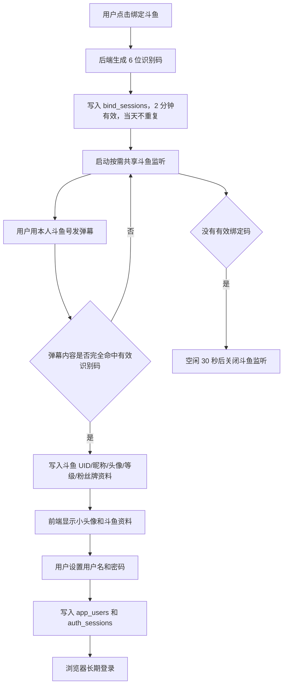

# 悬赏令 - 户外团播任务接单平台

当前版本：`v0.0.0`

武侠风格的任务悬赏展示平台。现在除了任务发布/展示/后台管理外，还加入了 **斗鱼账号绑定** 和 **用户名密码登录** 流程：用户先在前端生成 2 分钟有效的 6 位识别码，把识别码发到指定直播间弹幕里，服务端按需监听命中后回写斗鱼资料，再让用户设置用户名和密码完成绑定。

## 当前能力

- 首页展示悬赏令列表，支持按状态/礼物/关键词筛选
- 任务详情页：看任务信息、跟单记录、隐藏任务、标记完成
- 发布页：创建主任务或隐藏任务
- 后台页：任务 CRUD、跟单管理
- 斗鱼绑定页：生成识别码、等待弹幕命中、回写斗鱼资料、设置用户名和密码
- 登录页：用户名密码登录，浏览器可长期保持登录态

## 技术栈

- 前端：React + Vite
- 后端：Node.js 原生 HTTP 服务 + 斗鱼弹幕监听
- 数据库：Supabase PostgreSQL
  - Supabase 底层是成熟的 **PostgreSQL SQL 数据库**，适合正式保存用户、绑定、登录会话和任务数据。
  - 用户密码不存明文，只存 `scrypt` 哈希和盐。
  - 登录 Cookie 只给浏览器，数据库只存 token 哈希。

## 技术文档

- `docs/TECHNICAL_HANDOFF.md`：给合作开发者/部署人员的完整接手说明。
- `supabase/binding_increment.sql`：已有 Supabase SQL 数据库只需要执行的增量建表脚本。
- `supabase/migration.sql`：全新空数据库初始化脚本。

## 目录说明

- `src/`：前端页面和组件
- `server/`：绑定码生成、斗鱼弹幕监听、账号和会话接口
- `supabase/migration.sql`：全新数据库表结构和安全约束
- `supabase/binding_increment.sql`：已有数据库专用的斗鱼绑定增量 SQL

## 运行逻辑图



## 斗鱼绑定规则

1. 用户点击“绑定斗鱼”。
2. 后端生成一个 **6 位、大小写不区分、数字+字母混合** 的识别码。
3. 识别码有效期 **2 分钟**，并且同一天不会重复。
4. 用户必须把识别码原样发送到指定直播间弹幕；只接受完全匹配，避免误判。
5. 后端只在有有效绑定码时监听斗鱼弹幕：
   - 平时不监听。
   - 第一个用户生成识别码时启动监听。
   - 多个用户同时绑定时共用同一个监听连接。
   - 没有有效绑定码后空闲 30 秒自动关闭监听。
6. 命中后读取并保存斗鱼 UID、昵称、头像、等级、粉丝牌名和粉丝牌等级。
7. 用户在前端设置用户名和密码，完成账号创建。
8. 后端写入长期登录会话，浏览器关闭后仍可保持登录。

## 数据库表

如果是已有 Supabase 数据库，执行 `supabase/binding_increment.sql` 后会补齐这些和绑定/登录相关的表；如果是全新空数据库，可以执行 `supabase/migration.sql`：

- `douyu_profiles`：斗鱼用户资料缓存，保存房间、UID、昵称、头像、等级、粉丝牌、最近发言时间等。
- `bind_sessions`：绑定识别码会话，保存识别码、有效期、命中的斗鱼资料、原始命中弹幕和完成状态。
- `app_users`：正式用户账号表，保存用户名、密码哈希、斗鱼 UID/昵称/头像/等级/粉丝牌等用户信息。
- `auth_sessions`：长期登录会话表，只保存 session token 哈希和有效期。

用户信息最终以 `app_users` 为准，`bind_sessions` 保留本次绑定过程，`douyu_profiles` 用来缓存斗鱼弹幕资料。

## 环境变量

创建 `.env`：

```bash
VITE_SUPABASE_URL=https://tbtvgdeljiiwzixwiwue.supabase.co
VITE_SUPABASE_ANON_KEY=your-supabase-anon-key
SUPABASE_URL=https://tbtvgdeljiiwzixwiwue.supabase.co
SUPABASE_SECRET_KEY=your-supabase-secret-or-service-role-key
# SUPABASE_SERVICE_ROLE_KEY=your-legacy-service-role-key
DOUYU_BIND_ROOM_ID=63136
APP_TIME_ZONE=Asia/Shanghai
BIND_SERVER_ALLOW_ORIGIN=http://127.0.0.1:5173
DOUYU_BIND_IDLE_STOP_MS=30000
COOKIE_SECURE=false
```

生产环境如果是 HTTPS，把 `COOKIE_SECURE=true`。

## 本地运行

### 前端

```bash
npm install
npm run dev
```

### 后端绑定服务

```bash
npm run server
```

默认前端会把 `/api` 转发到 `http://127.0.0.1:8788`。

## 部署

1. 前端推到 GitHub 后可继续接 Vercel / 静态部署。
2. 绑定服务需要单独部署到常驻 Node 环境，但斗鱼弹幕连接会按需启动/关闭。
3. 配好 Supabase 服务角色密钥和斗鱼房间号。
4. 生产环境建议把前端和 `/api` 反向代理到同一域名，保证登录 Cookie 可用。

## 从零恢复步骤

1. 克隆仓库。
2. 执行 `npm install`。
3. 已有数据库执行 `supabase/binding_increment.sql`；全新空数据库才执行 `supabase/migration.sql`。
4. 按 `.env.example` 补齐 `.env`，尤其是 `SUPABASE_SECRET_KEY` 或 `SUPABASE_SERVICE_ROLE_KEY`。
5. 本地执行 `npm run server` 和 `npm run dev`。
6. 打开前端 `/bind`，生成识别码并发到配置的斗鱼直播间验证。
7. 验证数据库里 `bind_sessions`、`app_users`、`auth_sessions` 均有记录。

## 验证方式

```bash
npm run build
npm run lint
node --check server/index.mjs
node --check server/douyu.mjs
node --check server/store.mjs
node --check server/auth.mjs
```

## 注意事项

- `src/lib/supabase.js` 现在支持环境变量，也保留了默认值，方便本地先跑起来。
- 后端没有拿到 `SUPABASE_SECRET_KEY` / `SUPABASE_SERVICE_ROLE_KEY` 时，只能启动基础 HTTP 服务，无法写库和监听绑定流程。
- 后台密码目前仍是前端轻量门禁，后续如果要正式上线，建议换成真正的后端鉴权。
- 所有头像展示都压到小尺寸：绑定确认头像 36px，其它列表/详情头像 24-32px，并启用懒加载，避免大头像撑开页面。
- 斗鱼头像字段已按斗鱼图片地址规则规范化；如果仍然无法识别为可访问图片，前端会显示占位头像。
- 识别码虽然只在 2 分钟内有效，但用户必须在有效期内完成“发送弹幕 + 提交用户名密码”整套流程，超时后需要重新生成。
- 绑定和账号表启用了 RLS；前端不能直接读写用户账号表，必须通过服务端 API。

## 本次改动记录

- 新增斗鱼绑定、用户注册、登录会话基础链路。
- 新增后端弹幕监听服务和 Supabase 数据表。
- 斗鱼监听改为“按需共享监听 + 空闲自动关闭”。
- 前端新增绑定页和登录页。
- 前端改用 `/api` 绑定服务，支持长期登录态。
- 所有头像展示压缩为小尺寸。
- 数据库新增用户资料完整入库、账号唯一性、RLS 和注释说明。
- 新增 `docs/TECHNICAL_HANDOFF.md` 和 `supabase/binding_increment.sql`，方便合作开发者在已有 SQL 数据库上增量接入。
