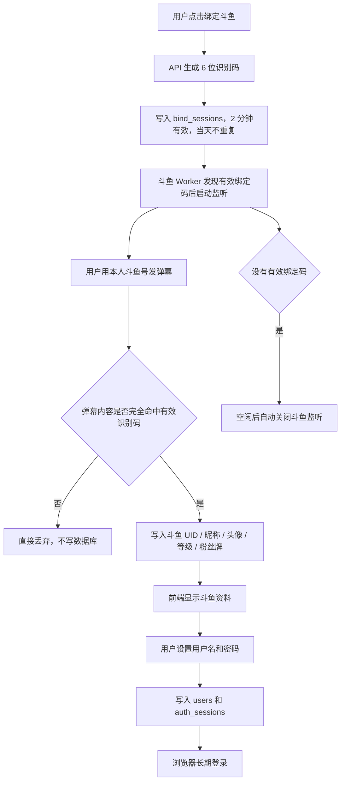
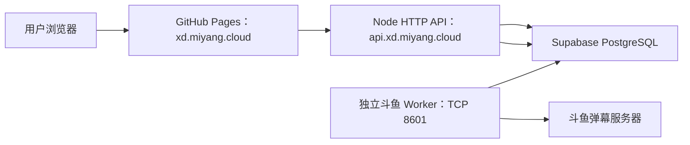
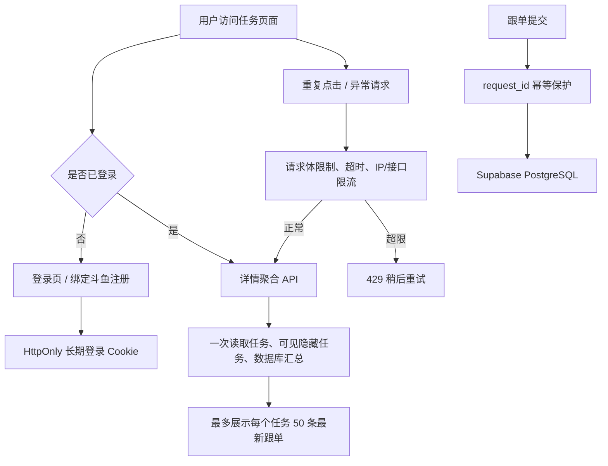
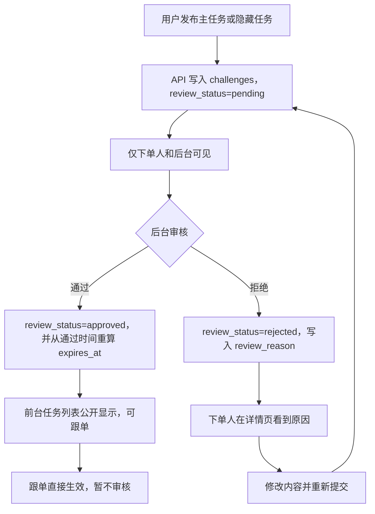

# 亿星传媒 - 户外团播任务接单平台

当前版本：`v0.0.2`

武侠风格的任务悬赏展示平台。当前代码已经合并两条主线：

1. **主分支 v3 任务系统**：`users`、`settings`、`created_by`、隐藏任务可见性、黑名单、最低斗鱼等级。
2. **斗鱼绑定 / 长期登录系统**：2 分钟识别码、指定直播间弹幕命中、斗鱼资料回写、用户名密码注册、浏览器长期登录。

## 当前能力

- 首页展示悬赏令列表，支持按状态 / 礼物 / 关键词筛选；任务默认有效 3 小时，可选 3 / 5 / 8 / 12 / 24 小时，到期后显示“已到期”并禁止跟单；页面打开期间每 10 秒静默检查新任务，切回浏览器时立即检查，不需要手动刷新
- 任务详情页：看任务信息、跟单记录、下单时间（年月日、时分秒、周几，按中国时区显示）、隐藏任务、标记完成、添加隐藏任务
- 发布页：创建主任务或隐藏任务，普通用户的老板信息由后端从登录态自动写入 `boss_id` / `created_by`；新单默认进入后台审核，通过后才会公开显示；被拒绝时下单人可看到原因并修改后重新提交
- 后台页：任务 CRUD、任务审核、跟单管理、用户管理、配置管理；任务审核支持通过/拒绝并填写拒绝原因，通过时会从当前时间重新计算有效期；任务编辑可查看到期时间，并在确认后重设有效期；用户管理支持通过后端接口手动修正斗鱼资料，并显示用户总览、绑定记录、头像、斗鱼 UID、等级、粉丝牌、注册/登录时间和数据缺失诊断
- 斗鱼绑定页：生成识别码、等待弹幕命中、回写斗鱼资料、设置用户名和密码；用户名支持中文、英文字母或数字（2-20 位），普通前台只读斗鱼资料，不提供手填入口
- 登录页：用户名密码登录，浏览器可长期保持登录态；未登录只能访问登录页和“绑定斗鱼注册”页，任务首页、详情和发布页会先跳转登录，后端任务接口也会返回 401
- 管理后台：`/xiaoyangadmin/`，支持多个超级管理员账号登录
- 网站对外名称为“亿星传媒”；浏览器标签、前台品牌条和后台标题均使用该名称

## 技术栈

- 前端：React + Vite
- 后端：Node.js 原生 HTTP API + 独立斗鱼弹幕 Worker
- 数据库：Supabase PostgreSQL（正式 SQL 数据库）
  - `users` 是当前统一用户表，保存站内账号、斗鱼资料、黑名单和登录记录；斗鱼资料由绑定接口和后台手动接口共同写入。
  - 用户密码不存明文，只存 `scrypt` 哈希和盐。
- 登录 Cookie 只给浏览器，数据库只存 token 哈希。
- 前端页面不会让普通用户手动填写斗鱼资料或老板身份；即使有人改浏览器请求，后端也会按登录态覆盖普通用户的 `boss_id` / `created_by`。
- 管理员后台预录入的“只有斗鱼资料、没有用户名密码”的记录，后续可以被同 UID 用户通过弹幕绑定补全为正式账号；后台修正已绑定用户斗鱼资料时不会清空用户名和密码哈希。

### 前端性能

- 路由页面使用懒加载：打开首页时不会提前下载后台、绑定、登录、发布和详情页代码。
- 首页任务列表的跟单汇总由 API 一次返回，避免“每个任务再请求一次跟单数据”的请求放大。
- 首页任务列表采用前台轻量轮询：可见页面每 10 秒请求一次批量任务接口，浏览器切到后台时暂停，重新切回时立即请求；轮询不会清空现有列表或显示加载遮罩。
- API 响应和前端 `fetch` 均禁用缓存，避免新任务被浏览器、代理或 CDN 返回旧列表。
- 当前构建按页面拆分 JS/CSS；本地构建中入口公共 JS 约 74 KB gzip，首页所需页面代码约 2 KB gzip，其余页面进入时再下载。实际访问还会包含 API 数据和头像请求。
- 头像优先使用斗鱼缩略图链接；CSS 的小尺寸只影响显示，不能替代图片源本身的压缩。
- 详情页使用 `GET /api/challenges/:id/detail` 一次返回任务、可见隐藏任务、跟单汇总和限量记录，不再产生详情页 N+1 请求。
- API 增加请求体上限、连接超时、按接口限流和前端 15 秒超时；跟单请求带 `request_id`，执行数据库增量 SQL 后可防止网络重试造成重复跟单。

## 核心流程图

### 绑定流程



### 前后端分离部署



### 登录、详情与抗压流程




### 任务审核流程



## 数据库结构

### 主分支 v3 业务表

- `users`：统一用户表，保存用户名、密码哈希、斗鱼 UID/昵称/头像/等级、黑名单、最后登录时间。
- `settings`：配置表，目前主要保存 `min_douyu_level`。
- `challenges`：任务表，包含 `created_by`、`review_status` / `review_reason`、`validity_hours`（3/5/8/12/24）和 `expires_at`。普通用户新单默认 `pending`，后台 `approved` 后公开显示；`rejected` 会把原因返回给下单人。任务是否到期由 API 按当前时间动态判断，不依赖定时写库。
- `follow_orders`：跟单表，新增 `created_by` 字段。
- `challenge_gifts`：任务礼物统计视图。
- `challenges_with_hidden`：主任务 + 隐藏任务视图。

### 斗鱼绑定表

- `douyu_profiles`：斗鱼弹幕资料缓存。
- `bind_sessions`：识别码会话，保存 code、有效期、命中资料和状态。
- `auth_sessions`：长期登录会话，只保存 token 哈希。

> 旧数据库如果还保留 `app_users`，建议迁移到 `users`。当前代码已经以 `users` 为准。后台如果出现“任务有创建者 ID，但 users 表查不到用户”的红色诊断提示，说明注册数据没有落在当前 `users` 表、用户记录被误删，或数据库迁移未执行完整；这种情况下任务仍能显示，但头像和用户详情无法补全。后台“绑定记录”tab 可继续判断识别码是否完成、是否已有 `user_id`。

## 目录说明

- `src/`：前端页面和组件
- `server/`：绑定码生成、斗鱼弹幕监听、账号和会话接口
- `supabase/migration.sql`：全新数据库初始化脚本
- `supabase/binding_increment.sql`：已有数据库的 v3 + 绑定增量更新脚本
- `supabase/task_expiration_increment.sql`：已上线数据库新增任务有效期的增量脚本
- `supabase/performance_increment.sql`：详情页性能索引、跟单汇总视图和跟单幂等字段增量脚本（需数据库维护者执行）
- `supabase/challenge_review_increment.sql`：任务审核字段、审核状态索引和旧任务默认通过的增量脚本（需数据库维护者执行）
- `docs/`：接手文档和部署说明

## 环境变量

创建 `.env`：

```bash
# GitHub Pages 前端调用 API 的地址；同域部署或本地 Vite proxy 可留空。
VITE_API_BASE_URL=https://api.xd.miyang.cloud

SUPABASE_URL=https://srngkjdqufardczwjxxr.supabase.co
SUPABASE_SECRET_KEY=your-supabase-secret-or-service-role-key
# 或兼容老写法：SUPABASE_SERVICE_ROLE_KEY=your-legacy-service-role-key

DOUYU_BIND_ROOM_ID=63136
APP_TIME_ZONE=Asia/Shanghai
DOUYU_DANMAKU_HOSTS=danmuproxy.douyu.com,openbarrage.douyutv.com
BIND_SERVER_ALLOW_ORIGIN=https://xd.miyang.cloud,http://127.0.0.1:5173,http://localhost:5173
BIND_SERVER_BASE_URL=https://api.xd.miyang.cloud
DOUYU_WORKER_POLL_MS=2000
DOUYU_BIND_IDLE_STOP_MS=30000
COOKIE_SECURE=true
COOKIE_SAME_SITE=Lax
ADMIN_CREDENTIALS=admin1:change-me,admin2:change-me
ADMIN_SESSION_SECRET=change-me-to-a-long-random-string
```

## 本地启动

```bash
npm install
# 终端 1：启动 HTTP API
npm run server:api
# 终端 2：启动斗鱼 Worker
npm run worker:douyu
# 终端 3：启动前端开发服务
npm run dev
```

默认前端通过 `/api` 访问后端。

## 验证清单

```bash
npm run build
npm run lint
node --check server/index.mjs
node --check server/douyu.mjs
node --check server/store.mjs
node --check server/data.mjs
node --check server/worker.mjs
node --check server/auth.mjs
```

完整业务验证：

1. 打开 `/bind`，先完成斗鱼绑定。
2. 点击生成识别码。
3. 用斗鱼账号到指定直播间发送该识别码。
4. 管理员如需补数据或修错，可在后台通过接口手动修正斗鱼资料。
5. 发布挑战时默认显示 3 小时有效期，可选择 3 / 5 / 8 / 12 / 24 小时。
6. 发布挑战、跟单、添加隐藏任务时，“老板信息”会自动读取当前登录用户信息，不再手动输入。
7. 页面出现斗鱼 UID、昵称、头像、等级、粉丝牌（头像仅以小缩略图显示）。
8. 输入用户名和两次密码。
9. 完成绑定并跳回首页。
10. Supabase 检查：
   - `bind_sessions` 有 matched/completed 记录。
   - `users` 有用户记录，且 `douyu_uid` 不为空；如果后台用户数为 0，但任务里有 `created_by`，优先检查是否旧表 `app_users` 未迁移或用户记录被清空。
   - `auth_sessions` 有登录会话记录。
11. 在后台编辑任务，勾选“重新开始计算有效期”后保存，确认到期时间从当前时间重新计算；等待到期后，前台显示已到期且跟单接口被拒绝。
12. 关闭浏览器再打开，确认仍是登录状态。

## 部署提醒

这个功能不能只部署静态前端，因为斗鱼弹幕监听需要常驻 Node 服务。

当前已适配两种部署口径：

1. **旧口径 / 应急口径**：服务器同时托管前端构建产物和 Node API。
2. **推荐口径 / 大访问量口径**：GitHub Pages 托管前端，服务器只保留 `api.xd.miyang.cloud` 的 HTTP API 和独立斗鱼 Worker。

推荐生产结构：

- 前台：`https://xd.miyang.cloud/`，由 GitHub Pages 发布 `dist/`。
- API：`https://api.xd.miyang.cloud/api/...`，由服务器 Nginx 反代到 `127.0.0.1:8788`。
- 斗鱼监听：独立 `bounty-board-douyu-worker.service`，只在有有效绑定码时连接斗鱼 TCP 8601。
- 前端顶部不再提供后台管理入口；后台仍可通过直接地址访问。
- 前端不再直接调用 Supabase 表，统一通过 API 访问，隐藏任务可见性和管理员权限由后端兜底。
- 跨域 GET 请求不要无脑带 `Content-Type: application/json`，否则 GitHub Pages 前台访问 API 会额外触发 CORS 预检，访问量大时会放大后端压力。

当前仓库已提供 GitHub Pages Actions、CNAME、Nginx 模板和 systemd 模板。正式切换前需要在 GitHub Pages 和 DNS 控制台完成绑定。

### 任务有效期上线顺序

1. 在 Supabase SQL Editor 执行 `supabase/task_expiration_increment.sql`。
2. 部署新的 API 服务（前端可由 GitHub Pages 自动发布）。
3. 验证新任务默认 3 小时、五档可选、后台重新设置期限、到期后前端/接口均禁止跟单。

> 说明（2026-09-17 复核）：前台已经切换为 GitHub Pages 托管，`https://xd.miyang.cloud/` 正常访问，GitHub Pages 证书状态为 approved。当前 Pages 的 `https_enforced` 仍为 `false`，所以 `http://xd.miyang.cloud/` 可能仍直接返回页面；要完全满足 HTTPS-only，需要仓库管理员在 GitHub 仓库 `Settings -> Pages` 打开 `Enforce HTTPS`。当前部署账号只有仓库写入权限，不能代替管理员修改这个设置。

- 2026-09-08 已重新同步生产前端/后端构建，确保新增超级管理员账号在生产环境可直接登录后台。

### 用户名规则更新

- 用户名现在支持中文、英文字母和数字，可混合使用，长度为 2-20 位。
- 用户名仍不允许空格、下划线、标点、表情或其它特殊字符。
- 2026-09-19 已发布到 GitHub Pages；API 校验已同步部署到 VPS，部署前备份位于 `/opt/bounty-board/backups/pre-deploy-username-digits-20260918T173212Z`。

### 2026-09-19 详情页、登录门禁与抗重复请求优化（待部署）

- 未登录访问任务首页、详情和发布页会进入 `/login`；登录页提供“绑定斗鱼注册”，登录后会回到原来想访问的页面。
- 后端任务读取和跟单接口强制校验登录态；管理员 Cookie 仍可正常访问后台数据。
- 详情页改为单次聚合请求，跟单汇总不因展示记录限量而减少；默认每个任务最多展示 50 条最新记录。
- API 对登录、绑定码、任务列表、发布、跟单和后台接口分别限流；请求体限制 256 KB，Node 请求超时 15 秒，Nginx 代理超时和请求体上限同步收紧。
- `supabase/performance_increment.sql` 需要朋友在 Supabase 执行；未执行前代码仍兼容旧库，但跟单幂等唯一约束和聚合视图不会生效。
- 本次只改代码、部署模板和文档，未执行 Supabase SQL，未重启 VPS，未重启斗鱼 Worker。

### 最近一次性能优化部署

- GitHub `main` 已合并提交 `3662031`，GitHub Pages Actions 运行 `35248698651` 成功。
- 前台 `https://xd.miyang.cloud/` 已提供懒加载路由和批量跟单汇总优化版本。
- VPS `111.229.102.231` 已部署提交 `5f679b4` 对应代码；`bounty-board-api.service` 和 `bounty-board-douyu-worker.service` 均为 active，旧 `bounty-board-bind.service` 为 inactive。
- API `https://api.xd.miyang.cloud/api/health` 返回 200；任务列表接口已确认返回 `follow_summary`。
- 部署前代码备份：`/opt/bounty-board/backups/pre-deploy-20260917T165158Z-5f679b4/source.tar.gz`。
- 数据库已确认存在 `challenges.validity_hours` 和 `challenges.expires_at`，本次没有重复执行迁移脚本。

### 品牌与完整下单时间前端发布

- 2026-09-17 合并 PR #8 到 GitHub `main`，合并提交为 `2d285094`。
- GitHub Pages Actions 运行 `35254435806` 的 `build` 和 `deploy` 均成功。
- 前台浏览器标题、品牌名称已更新为“亿星传媒”；“突围特工队”文案已移除。
- 前台和后台下单/跟单记录显示完整的中国时间：`YYYY-MM-DD HH:mm:ss 星期几`。
- 本次只发布 GitHub Pages 前端，不重启 VPS API 或斗鱼 Worker；API `/api/health` 仍返回 200。
- v0.0.1 已合并到 GitHub `main`（`5553e5a`），Pages Actions `35378965625` 已成功，GitHub Release 和标签 `v0.0.1` 已创建。


### 首页新任务自动刷新修复（v0.0.1）

- 首页现在每 10 秒静默检查一次新任务；浏览器切到后台时暂停，切回前台立即检查。
- 自动检查不会清空已经显示的任务，也不会反复显示“加载中”。
- 前端请求和 API JSON 响应均使用 `no-store`，避免浏览器、代理或 CDN 返回旧任务列表。
- 本版本不修改数据库，不改变斗鱼 Worker 监听逻辑。
- API 已部署到 VPS，备份位于 `/opt/bounty-board/backups/pre-deploy-auto-refresh-20260918T175604Z`；线上 `/api/health` 返回 200，任务接口返回 `Cache-Control: no-store`。

### 生产 HTTPS 状态

- 前台托管：GitHub Pages，绑定域名 `xd.miyang.cloud`。
- GitHub Pages 证书：已批准，当前证书到期时间为 2026-12-13。
- GitHub Pages 当前 `https_enforced=false`；HTTPS 可以访问，但 HTTP 前台尚未被强制跳转或拒绝。
- 证书域名：`xd.miyang.cloud`
- 证书路径：`/etc/letsencrypt/live/xd.miyang.cloud/fullchain.pem`
- 私钥路径：`/etc/letsencrypt/live/xd.miyang.cloud/privkey.pem`
- 到期时间：2026-12-05
- 签发方式：Let's Encrypt + certbot manual DNS-01 + DNSPod API hook。
- Nginx 配置：`/etc/nginx/conf.d/xd.miyang.cloud.conf`。
- 当前策略：前台 HTTPS 正常访问；HTTP 前台是否跳转由 GitHub Pages 的 `Enforce HTTPS` 设置决定，当前尚未开启；API 的 HTTP 入口不提供正常响应，服务器 IP 直连不作为前台入口。
- 续期提醒：DNSPod Token 只登记在全局敏感信息文档和服务器 hook 文件中，不能提交到 GitHub。

## 常见问题

### 前台和后台访问地址

- 前台：`https://xd.miyang.cloud/`
- 后台：`https://xd.miyang.cloud/xiaoyangadmin/`
- API：`https://api.xd.miyang.cloud/api/health`


### 页面能打开，但生成识别码失败

检查后端是否启动，以及 `.env` 是否有 `SUPABASE_SECRET_KEY` 或 `SUPABASE_SERVICE_ROLE_KEY`。

### 能生成识别码，但发弹幕没反应

检查：

- `DOUYU_BIND_ROOM_ID` 是否是正确直播间。
- 后端日志是否显示斗鱼连接成功。
- 弹幕内容是否完全等于识别码。
- 是否已经超过 2 分钟。

### 绑定完成失败，提示斗鱼账号已绑定

这是正常保护：同一个斗鱼 UID 只能绑定一次。

### 昵称改了怎么办

不影响登录。系统身份认 `douyu_uid`，昵称只用于显示。

## 技术文档

- `docs/TECHNICAL_HANDOFF.md`
- `docs/FRIEND_SETUP_SHORT.md`
- `docs/SQL_DATABASE.md`
- `docs/GITHUB_PAGES_API_WORKER_SPLIT.md`

### 后台跟单记录优化（v0.0.2）

- 后台“跟单管理”现在同时显示“主任务”和“跟单任务”。
- 主任务跟单会显示“主任务跟单”；隐藏任务跟单会显示所属主任务标题，并标记“隐藏任务”。
- 本次只修改后台展示和前端版本号，不修改数据库，不改变跟单数据。

### 2026-09-22 详情页 Not found 修复

- 现象：用户下单后可以在任务列表看到任务，但点击任务进入详情页提示“加载失败：Not found”。
- 根因：GitHub Pages 前端已经调用详情聚合接口 `GET /api/challenges/:id/detail`，VPS API 当时仍运行旧后端文件，未包含该路由。
- 处理：PR #17 合并到 `main` 后，重新发布 Pages 前端；同步部署 API 详情路由。部署前备份为 `/opt/bounty-board/backups/pre-deploy-detail-route-20260922T110249Z`。
- 验证：线上管理员会话请求真实任务详情接口返回 `ok=true`；`bounty-board-api.service` 和 `bounty-board-douyu-worker.service` 均 active；数据库和斗鱼 Worker 监听逻辑未改。
