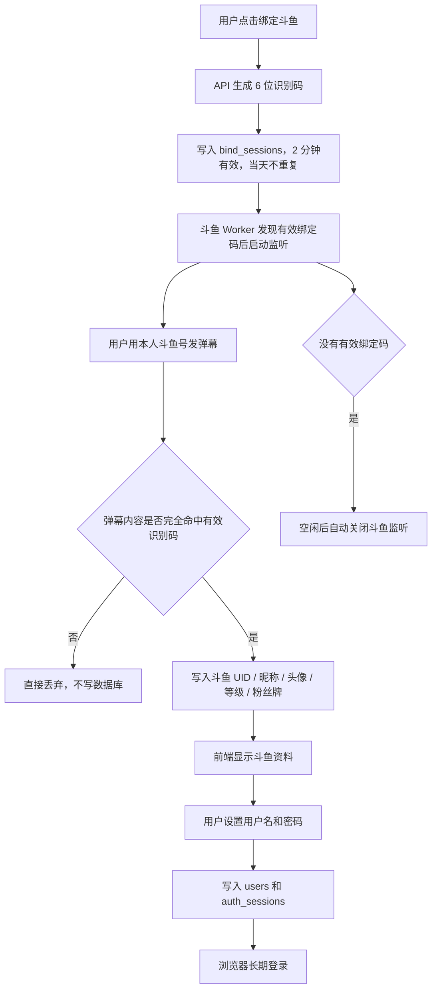
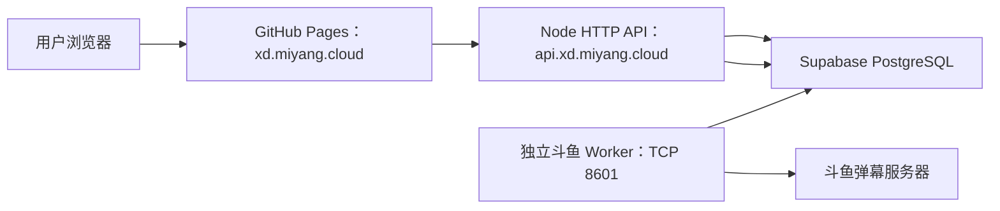

# 悬赏令 - 户外团播任务接单平台

当前版本：`v0.0.0`

武侠风格的任务悬赏展示平台。当前代码已经合并两条主线：

1. **主分支 v3 任务系统**：`users`、`settings`、`created_by`、隐藏任务可见性、黑名单、最低斗鱼等级。
2. **斗鱼绑定 / 长期登录系统**：2 分钟识别码、指定直播间弹幕命中、斗鱼资料回写、用户名密码注册、浏览器长期登录。

## 当前能力

- 首页展示悬赏令列表，支持按状态 / 礼物 / 关键词筛选
- 任务详情页：看任务信息、跟单记录、隐藏任务、标记完成、添加隐藏任务
- 发布页：创建主任务或隐藏任务，普通用户的老板信息由后端从登录态自动写入 `boss_id` / `created_by`
- 后台页：任务 CRUD、跟单管理、用户管理、配置管理；用户管理支持通过后端接口手动修正斗鱼资料
- 斗鱼绑定页：生成识别码、等待弹幕命中、回写斗鱼资料、设置用户名和密码；普通前台只读斗鱼资料，不提供手填入口
- 登录页：用户名密码登录，浏览器可长期保持登录态
- 管理后台：`/xiaoyangadmin/`，支持多个超级管理员账号登录

## 技术栈

- 前端：React + Vite
- 后端：Node.js 原生 HTTP API + 独立斗鱼弹幕 Worker
- 数据库：Supabase PostgreSQL（正式 SQL 数据库）
  - `users` 是当前统一用户表，保存站内账号、斗鱼资料、黑名单和登录记录；斗鱼资料由绑定接口和后台手动接口共同写入。
  - 用户密码不存明文，只存 `scrypt` 哈希和盐。
- 登录 Cookie 只给浏览器，数据库只存 token 哈希。
- 前端页面不会让普通用户手动填写斗鱼资料或老板身份；即使有人改浏览器请求，后端也会按登录态覆盖普通用户的 `boss_id` / `created_by`。
- 管理员后台预录入的“只有斗鱼资料、没有用户名密码”的记录，后续可以被同 UID 用户通过弹幕绑定补全为正式账号；后台修正已绑定用户斗鱼资料时不会清空用户名和密码哈希。

## 核心流程图

### 绑定流程



### 前后端分离部署



## 数据库结构

### 主分支 v3 业务表

- `users`：统一用户表，保存用户名、密码哈希、斗鱼 UID/昵称/头像/等级、黑名单、最后登录时间。
- `settings`：配置表，目前主要保存 `min_douyu_level`。
- `challenges`：任务表，新增 `created_by` 字段。
- `follow_orders`：跟单表，新增 `created_by` 字段。
- `challenge_gifts`：任务礼物统计视图。
- `challenges_with_hidden`：主任务 + 隐藏任务视图。

### 斗鱼绑定表

- `douyu_profiles`：斗鱼弹幕资料缓存。
- `bind_sessions`：识别码会话，保存 code、有效期、命中资料和状态。
- `auth_sessions`：长期登录会话，只保存 token 哈希。

> 旧数据库如果还保留 `app_users`，建议迁移到 `users`。当前代码已经以 `users` 为准。

## 目录说明

- `src/`：前端页面和组件
- `server/`：绑定码生成、斗鱼弹幕监听、账号和会话接口
- `supabase/migration.sql`：全新数据库初始化脚本
- `supabase/binding_increment.sql`：已有数据库的增量更新脚本
- `docs/`：接手文档和部署说明

## 环境变量

创建 `.env`：

```bash
# GitHub Pages 前端调用 API 的地址；同域部署或本地 Vite proxy 可留空。
VITE_API_BASE_URL=https://api.xd.miyang.cloud

SUPABASE_URL=https://srngkjdqufardczwjxxr.supabase.co
SUPABASE_SECRET_KEY=your-supabase-secret-or-service-role-key
# 或兼容老写法：SUPABASE_SERVICE_ROLE_KEY=your-legacy-service-role-key

DOUYU_BIND_ROOM_ID=63136
APP_TIME_ZONE=Asia/Shanghai
DOUYU_DANMAKU_HOSTS=danmuproxy.douyu.com,openbarrage.douyutv.com
BIND_SERVER_ALLOW_ORIGIN=https://xd.miyang.cloud,http://127.0.0.1:5173,http://localhost:5173
BIND_SERVER_BASE_URL=https://api.xd.miyang.cloud
DOUYU_WORKER_POLL_MS=2000
DOUYU_BIND_IDLE_STOP_MS=30000
COOKIE_SECURE=true
COOKIE_SAME_SITE=Lax
ADMIN_CREDENTIALS=admin1:change-me,admin2:change-me
ADMIN_SESSION_SECRET=change-me-to-a-long-random-string
```

## 本地启动

```bash
npm install
# 终端 1：启动 HTTP API
npm run server:api
# 终端 2：启动斗鱼 Worker
npm run worker:douyu
# 终端 3：启动前端开发服务
npm run dev
```

默认前端通过 `/api` 访问后端。

## 验证清单

```bash
npm run build
npm run lint
node --check server/index.mjs
node --check server/douyu.mjs
node --check server/store.mjs
node --check server/data.mjs
node --check server/worker.mjs
node --check server/auth.mjs
```

完整业务验证：

1. 打开 `/bind`，先完成斗鱼绑定。
2. 点击生成识别码。
3. 用斗鱼账号到指定直播间发送该识别码。
4. 管理员如需补数据或修错，可在后台通过接口手动修正斗鱼资料。
5. 发布挑战、跟单、添加隐藏任务时，“老板信息”会自动读取当前登录用户信息，不再手动输入。
6. 页面出现斗鱼 UID、昵称、头像、等级、粉丝牌（头像仅以小缩略图显示）。
7. 输入用户名和两次密码。
8. 完成绑定并跳回首页。
9. Supabase 检查：
   - `bind_sessions` 有 matched/completed 记录。
   - `users` 有用户记录，且 `douyu_uid` 不为空。
   - `auth_sessions` 有登录会话记录。
9. 关闭浏览器再打开，确认仍是登录状态。

## 部署提醒

这个功能不能只部署静态前端，因为斗鱼弹幕监听需要常驻 Node 服务。

当前已适配两种部署口径：

1. **旧口径 / 应急口径**：服务器同时托管前端构建产物和 Node API。
2. **推荐口径 / 大访问量口径**：GitHub Pages 托管前端，服务器只保留 `api.xd.miyang.cloud` 的 HTTP API 和独立斗鱼 Worker。

推荐生产结构：

- 前台：`https://xd.miyang.cloud/`，由 GitHub Pages 发布 `dist/`。
- API：`https://api.xd.miyang.cloud/api/...`，由服务器 Nginx 反代到 `127.0.0.1:8788`。
- 斗鱼监听：独立 `bounty-board-douyu-worker.service`，只在有有效绑定码时连接斗鱼 TCP 8601。
- 前端顶部不再提供后台管理入口；后台仍可通过直接地址访问。
- 前端不再直接调用 Supabase 表，统一通过 API 访问，隐藏任务可见性和管理员权限由后端兜底。
- 跨域 GET 请求不要无脑带 `Content-Type: application/json`，否则 GitHub Pages 前台访问 API 会额外触发 CORS 预检，访问量大时会放大后端压力。

当前仓库已提供 GitHub Pages Actions、CNAME、Nginx 模板和 systemd 模板。正式切换前需要在 GitHub Pages 和 DNS 控制台完成绑定。

2026-09-09 生产阶段状态：

- GitHub `main` 已合并本功能，合并提交 `e698f3b`。
- 服务器已部署 `main` 同内容代码；旧 `bounty-board-bind.service` 已停用，已改为 `bounty-board-api.service` + `bounty-board-douyu-worker.service` 两个独立进程。
- `api.xd.miyang.cloud` 已解析到 `111.229.102.231`，HTTPS 证书已签发，`https://api.xd.miyang.cloud/api/health` 可用。
- `xd.miyang.cloud` 暂时仍解析到服务器旧前台，尚未切到 GitHub Pages；原因是当前 GitHub API 显示 Pages 站点未启用，且当前协作者权限为 `WRITE`，不能代替仓库管理员启用 Pages 设置。
- 等仓库管理员在 Settings → Pages 里选择 GitHub Actions 并绑定 `xd.miyang.cloud` 后，再把 `xd.miyang.cloud` 的 DNS 从 A 记录切为 GitHub Pages CNAME。

> 说明：`xd.miyang.cloud` 已在服务器上通过 DNSPod DNS-01 签发 Let's Encrypt 证书，并配置为 HTTPS-only；`http://xd.miyang.cloud/` 当前直接拒绝连接，不再提供明文 HTTP 页面。

- 2026-09-08 已重新同步生产前端/后端构建，确保新增超级管理员账号在生产环境可直接登录后台。


### 生产 HTTPS 状态

- 前台旧证书域名：`xd.miyang.cloud`
- 前台旧证书路径：`/etc/letsencrypt/live/xd.miyang.cloud/fullchain.pem`
- 前台旧私钥路径：`/etc/letsencrypt/live/xd.miyang.cloud/privkey.pem`
- 前台旧证书到期时间：2026-12-05
- API 证书域名：`api.xd.miyang.cloud`
- API 证书路径：`/etc/letsencrypt/live/api.xd.miyang.cloud/fullchain.pem`
- API 私钥路径：`/etc/letsencrypt/live/api.xd.miyang.cloud/privkey.pem`
- API 证书到期时间：2026-12-08
- 签发方式：Let's Encrypt + certbot manual DNS-01 + DNSPod API hook。
- Nginx 配置：`/etc/nginx/conf.d/xd.miyang.cloud.conf`、`/etc/nginx/conf.d/api.xd.miyang.cloud.conf`。
- 当前策略：HTTPS 正常访问；HTTP 域名访问返回空连接；HTTPS IP 直连走默认拒绝站点，不提供悬赏令页面；API 域名只开放 `/api/`。
- 续期提醒：DNSPod Token 只登记在全局敏感信息文档和服务器 hook 文件中，不能提交到 GitHub。

## 常见问题

### 前台和后台访问地址

- 前台：`https://xd.miyang.cloud/`
- 后台：`https://xd.miyang.cloud/xiaoyangadmin/`
- API：`https://api.xd.miyang.cloud/api/health`


### 页面能打开，但生成识别码失败

检查后端是否启动，以及 `.env` 是否有 `SUPABASE_SECRET_KEY` 或 `SUPABASE_SERVICE_ROLE_KEY`。

### 能生成识别码，但发弹幕没反应

检查：

- `DOUYU_BIND_ROOM_ID` 是否是正确直播间。
- 后端日志是否显示斗鱼连接成功。
- 弹幕内容是否完全等于识别码。
- 是否已经超过 2 分钟。

### 绑定完成失败，提示斗鱼账号已绑定

这是正常保护：同一个斗鱼 UID 只能绑定一次。

### 昵称改了怎么办

不影响登录。系统身份认 `douyu_uid`，昵称只用于显示。

## 技术文档

- `docs/TECHNICAL_HANDOFF.md`
- `docs/FRIEND_SETUP_SHORT.md`
- `docs/SQL_DATABASE.md`
- `docs/GITHUB_PAGES_API_WORKER_SPLIT.md`
