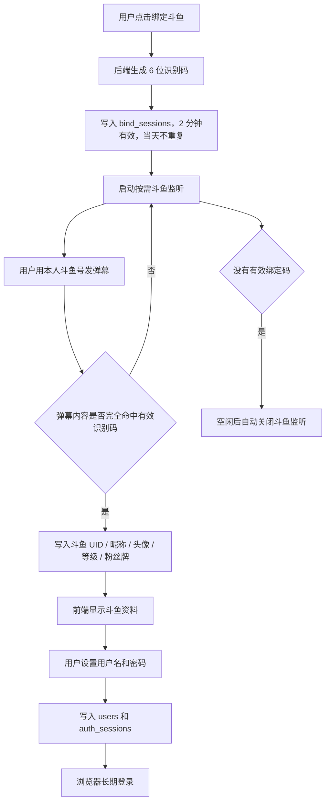

# 悬赏令 - 户外团播任务接单平台

当前版本：`v0.0.0`

武侠风格的任务悬赏展示平台。当前代码已经合并两条主线：

1. **主分支 v3 任务系统**：`users`、`settings`、`created_by`、隐藏任务可见性、黑名单、最低斗鱼等级。
2. **斗鱼绑定 / 长期登录系统**：2 分钟识别码、指定直播间弹幕命中、斗鱼资料回写、用户名密码注册、浏览器长期登录。

## 当前能力

- 首页展示悬赏令列表，支持按状态 / 礼物 / 关键词筛选
- 任务详情页：看任务信息、跟单记录、隐藏任务、标记完成、添加隐藏任务
- 发布页：创建主任务或隐藏任务，并写入 `created_by`
- 后台页：任务 CRUD、跟单管理、用户管理、配置管理
- 斗鱼绑定页：生成识别码、等待弹幕命中、回写斗鱼资料、设置用户名和密码
- 登录页：用户名密码登录，浏览器可长期保持登录态
- 管理后台：`/xiaoyangadmin/`，超级管理员账号单独登录

## 技术栈

- 前端：React + Vite
- 后端：Node.js 原生 HTTP 服务 + 斗鱼弹幕监听
- 数据库：Supabase PostgreSQL（正式 SQL 数据库）
  - `users` 是当前统一用户表，保存站内账号、斗鱼资料、黑名单和登录记录。
  - 用户密码不存明文，只存 `scrypt` 哈希和盐。
  - 登录 Cookie 只给浏览器，数据库只存 token 哈希。

## 核心流程图



## 数据库结构

### 主分支 v3 业务表

- `users`：统一用户表，保存用户名、密码哈希、斗鱼 UID/昵称/头像/等级、黑名单、最后登录时间。
- `settings`：配置表，目前主要保存 `min_douyu_level`。
- `challenges`：任务表，新增 `created_by` 字段。
- `follow_orders`：跟单表，新增 `created_by` 字段。
- `challenge_gifts`：任务礼物统计视图。
- `challenges_with_hidden`：主任务 + 隐藏任务视图。

### 斗鱼绑定表

- `douyu_profiles`：斗鱼弹幕资料缓存。
- `bind_sessions`：识别码会话，保存 code、有效期、命中资料和状态。
- `auth_sessions`：长期登录会话，只保存 token 哈希。

> 旧数据库如果还保留 `app_users`，建议迁移到 `users`。当前代码已经以 `users` 为准。

## 目录说明

- `src/`：前端页面和组件
- `server/`：绑定码生成、斗鱼弹幕监听、账号和会话接口
- `supabase/migration.sql`：全新数据库初始化脚本
- `supabase/binding_increment.sql`：已有数据库的增量更新脚本
- `docs/`：接手文档和部署说明

## 环境变量

创建 `.env`：

```bash
VITE_SUPABASE_URL=https://tbtvgdeljiiwzixwiwue.supabase.co
VITE_SUPABASE_ANON_KEY=your-supabase-anon-key

SUPABASE_URL=https://tbtvgdeljiiwzixwiwue.supabase.co
SUPABASE_SECRET_KEY=your-supabase-secret-or-service-role-key
# 或兼容老写法：SUPABASE_SERVICE_ROLE_KEY=your-legacy-service-role-key

DOUYU_BIND_ROOM_ID=63136
APP_TIME_ZONE=Asia/Shanghai
BIND_SERVER_ALLOW_ORIGIN=http://127.0.0.1:5173
DOUYU_BIND_IDLE_STOP_MS=30000
COOKIE_SECURE=false
```

## 本地启动

```bash
npm install
npm run server
npm run dev
```

默认前端通过 `/api` 访问后端。

## 验证清单

```bash
npm run build
npm run lint
node --check server/index.mjs
node --check server/douyu.mjs
node --check server/store.mjs
node --check server/auth.mjs
```

完整业务验证：

1. 打开 `/bind`，先完成斗鱼绑定。
2. 点击生成识别码。
3. 用斗鱼账号到指定直播间发送该识别码。
4. 页面出现斗鱼 UID、昵称、头像、等级、粉丝牌。
5. 输入用户名和两次密码。
6. 完成绑定并跳回首页。
7. Supabase 检查：
   - `bind_sessions` 有 matched/completed 记录。
   - `users` 有用户记录，且 `douyu_uid` 不为空。
   - `auth_sessions` 有登录会话记录。
8. 关闭浏览器再打开，确认仍是登录状态。

## 部署提醒

这个功能不能只部署静态前端，因为斗鱼弹幕监听需要常驻 Node 服务。

推荐：

- 前台域名：`https://xd.miyang.cloud/`，静态资源可以直接放 GitHub 仓库并同步到服务器发布目录。
- 后台路由：`https://xd.miyang.cloud/xiaoyangadmin/`。
- 后端：一台能常驻运行 Node 的服务器。
- 生产：前台和 `/api` 最好同域反向代理，方便 httpOnly Cookie 稳定生效。

当前部署口径是：GitHub 仓库保留前端源码与构建流程，服务器只托管构建后的前端文件和 Node 后端。

> 说明：`xd.miyang.cloud` 目前已能通过 HTTP 打开；HTTPS 证书申请在当前服务器上遇到 Let's Encrypt 校验超时，后续补到 HTTPS 后再把同域访问切回完全加密。

## 常见问题

### 前台和后台访问地址

- 前台：`https://xd.miyang.cloud/`
- 后台：`https://xd.miyang.cloud/xiaoyangadmin/`


### 页面能打开，但生成识别码失败

检查后端是否启动，以及 `.env` 是否有 `SUPABASE_SECRET_KEY` 或 `SUPABASE_SERVICE_ROLE_KEY`。

### 能生成识别码，但发弹幕没反应

检查：

- `DOUYU_BIND_ROOM_ID` 是否是正确直播间。
- 后端日志是否显示斗鱼连接成功。
- 弹幕内容是否完全等于识别码。
- 是否已经超过 2 分钟。

### 绑定完成失败，提示斗鱼账号已绑定

这是正常保护：同一个斗鱼 UID 只能绑定一次。

### 昵称改了怎么办

不影响登录。系统身份认 `douyu_uid`，昵称只用于显示。

## 技术文档

- `docs/TECHNICAL_HANDOFF.md`
- `docs/FRIEND_SETUP_SHORT.md`
