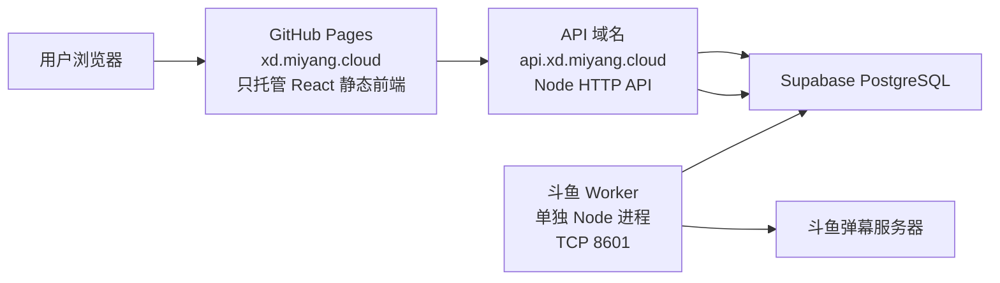

# GitHub Pages 前端 + 独立 API + 斗鱼 Worker 分离部署方案

## 1. 为什么要拆

当前项目有大访问量需求，不能长期让前端静态资源都从小带宽 VPS 直出；同时斗鱼弹幕监听是高频 TCP 长连接任务，不应该和 HTTP API 挤在同一个 Node 进程里。

拆分目标：



## 2. 拆完后各自负责什么

### GitHub Pages 前端

只负责：

- 页面展示
- 用户点击、表单、弹窗
- 调用 `VITE_API_BASE_URL` 指向的后端 API

不负责：

- 保存 service role key
- 直接信任前端做权限判断
- 斗鱼 TCP 弹幕监听
- 管理员密码校验

### Node HTTP API

只负责 HTTP 请求：

- 登录 / 退出 / 当前用户
- 绑定码生成、查询、完成绑定
- 任务、跟单、隐藏任务可见性过滤
- 黑名单、最低斗鱼等级、用户管理
- 管理员后台 Cookie 校验
- 普通用户发布、跟单、添加隐藏任务时，从登录 Cookie 自动写入 `boss_id` / `created_by`，不信任前端手填身份

入口文件：

```bash
server/index.mjs
```

启动命令：

```bash
npm run server:api
```

### 斗鱼 Worker

只负责斗鱼弹幕 TCP 监听：

- 按固定间隔查询数据库是否存在有效绑定码
- 有有效绑定码才连接斗鱼 8601 弹幕端口
- 没有有效绑定码时自动断开，避免常驻占用
- 弹幕先在内存匹配识别码
- 只有命中识别码后，才写入斗鱼 UID / 昵称 / 头像 / 等级 / 粉丝牌
- 未命中的普通弹幕不写数据库

入口文件：

```bash
server/worker.mjs
```

启动命令：

```bash
npm run worker:douyu
```

## 3. 前端 API 地址

本次新增统一请求入口：

```text
src/lib/http.js
```

前端所有后端请求都会走：

```bash
VITE_API_BASE_URL=https://api.xd.miyang.cloud
```

如果本地开发不填 `VITE_API_BASE_URL`，则继续走同域 `/api`，由 Vite proxy 转到 `127.0.0.1:8788`。

高访问量注意：统一请求层只在 `POST / PUT / PATCH` 等有 body 的请求上带 `Content-Type: application/json`；普通 `GET` 不主动带这个头，避免 GitHub Pages 跨域请求 API 时每次都触发 CORS 预检。

## 4. GitHub Pages 自动部署

已新增：

```text
.github/workflows/deploy-pages.yml
public/CNAME
```

Actions 会：

1. 代码合并到 `main`
2. `npm ci`
3. 用 `VITE_API_BASE_URL=https://api.xd.miyang.cloud` 构建
4. 发布 `dist/` 到 GitHub Pages
5. 把 `dist/index.html` 复制为 `dist/404.html`，解决 `/bind`、`/xiaoyangadmin/` 直接刷新 404 的问题

GitHub Pages 设置建议：

- Source：GitHub Actions
- Custom domain：`xd.miyang.cloud`
- Enforce HTTPS：开启

当前协作注意：

- 2026-09-09 GitHub `main` 已合并到 `e698f3b`，Actions 构建能开始，但部署阶段返回 `Ensure GitHub Pages has been enabled`。
- 当前协作者权限是 `WRITE`，不是仓库 `ADMIN`，无法通过 API 代替仓库管理员启用 Pages；需要仓库管理员在 Settings → Pages 里完成启用。
- Pages 未启用前，不要把 `xd.miyang.cloud` 从服务器 A 记录切到 GitHub Pages CNAME，否则前台会直接黑屏或 404。

DNS 建议：

```text
xd.miyang.cloud      CNAME    rialin-0523.github.io
api.xd.miyang.cloud  A        111.229.102.231
```

> 如果仓库迁移到其它 owner，`xd.miyang.cloud` 的 CNAME 目标要换成新的 `<owner>.github.io`。
> 2026-09-09：`api.xd.miyang.cloud` 的 A 记录已创建并解析到 `111.229.102.231`；`xd.miyang.cloud` 仍临时保留服务器 A 记录，等 Pages 启用后再切 CNAME。

## 5. 服务器部署

服务器只保留后端 API 和斗鱼 Worker，不再承担前端静态资源大流量。

已提供模板：

```text
deploy/systemd/bounty-board-api.service
deploy/systemd/bounty-board-douyu-worker.service
deploy/nginx/api.xd.miyang.cloud.conf
```

推荐服务名：

```bash
bounty-board-api.service
bounty-board-douyu-worker.service
```

旧的合并服务：

```bash
bounty-board-bind.service
```

切换完成后应停用，避免同时启动两个斗鱼监听器。

2026-09-09 服务器状态：

- 已部署 `bounty-board-api.service`，监听 `127.0.0.1:8788` / `*:8788`，Nginx 只从 `api.xd.miyang.cloud` 暴露 `/api/`。
- 已部署 `bounty-board-douyu-worker.service`，只负责斗鱼弹幕绑定 Worker。
- 旧 `bounty-board-bind.service` 已 `disable --now`。
- 星露谷残留 `stardew-panel-gate.service` 已保持停用。

## 6. 生产环境变量

服务器 `/etc/bounty-board.env` 至少需要：

```bash
SUPABASE_URL=https://srngkjdqufardczwjxxr.supabase.co
SUPABASE_SECRET_KEY=生产 service role key
DOUYU_BIND_ROOM_ID=63136
APP_TIME_ZONE=Asia/Shanghai
DOUYU_DANMAKU_HOSTS=danmuproxy.douyu.com,openbarrage.douyutv.com

BIND_SERVER_ALLOW_ORIGIN=https://xd.miyang.cloud,http://127.0.0.1:5173,http://localhost:5173
BIND_SERVER_BASE_URL=https://api.xd.miyang.cloud
COOKIE_SECURE=true
COOKIE_SAME_SITE=Lax

ADMIN_CREDENTIALS=管理员1:密码1,管理员2:密码2
ADMIN_SESSION_SECRET=一串足够长的随机字符串
ADMIN_SESSION_TTL_SECONDS=43200

DOUYU_WORKER_POLL_MS=2000
DOUYU_BIND_IDLE_STOP_MS=30000
```

注意：

- 管理员密码不要写进前端代码、README 或 GitHub。
- `ADMIN_CREDENTIALS` 只允许放服务器环境变量和敏感信息登记文档。
- 如果临时使用 GitHub 默认域名 `*.github.io` 访问前端，而不是 `xd.miyang.cloud`，登录 Cookie 可能需要 `COOKIE_SAME_SITE=None` 且 `COOKIE_SECURE=true`。

## 7. 切换步骤

### 第一步：合并代码

把本分支合并到 `main`。

### 第二步：启用 GitHub Pages

在 GitHub 仓库设置里：

1. 打开 Pages
2. Source 选择 GitHub Actions
3. Custom domain 填 `xd.miyang.cloud`
4. 等 Actions 跑完
5. 等 HTTPS 证书签发完成

### 第三步：配置 DNS

把：

```text
xd.miyang.cloud
```

从服务器 A 记录改为 GitHub Pages 的 CNAME。

新增：

```text
api.xd.miyang.cloud -> 111.229.102.231
```

### 第四步：配置 API HTTPS

服务器上申请 `api.xd.miyang.cloud` 证书，套用：

```text
deploy/nginx/api.xd.miyang.cloud.conf
```

然后：

```bash
sudo nginx -t
sudo systemctl reload nginx
```

如果用户要求“只要 HTTPS，不需要 HTTP 页面”，API 域名的 80 端口使用 `return 444;` 直接关闭连接，不做 HTTP 页面也不做跳转。API 证书已于 2026-09-09 通过 DNSPod DNS-01 签发，有效期至 2026-12-08。

### 第五步：拆 systemd 服务

```bash
sudo cp deploy/systemd/bounty-board-api.service /etc/systemd/system/
sudo cp deploy/systemd/bounty-board-douyu-worker.service /etc/systemd/system/
sudo systemctl daemon-reload
sudo systemctl enable --now bounty-board-api.service
sudo systemctl enable --now bounty-board-douyu-worker.service
sudo systemctl disable --now bounty-board-bind.service
```

### 第六步：验证

```bash
curl https://api.xd.miyang.cloud/api/health
```

必须看到：

```json
{
  "ok": true,
  "listener": "external-worker"
}
```

浏览器验证：

1. 打开 `https://xd.miyang.cloud/`
2. 首页能加载任务
3. `/bind` 能生成识别码
4. 发弹幕后能命中
5. 登录后刷新仍保持登录
6. `/xiaoyangadmin/` 能登录后台
7. 后台用户管理、配置管理可用

## 8. 这次必须长期记住的坑

- GitHub Pages 只能放前端静态文件，不能跑 Node 后端，也不能做斗鱼 TCP 监听。
- 前端上 Pages 后，所有 `/api` 都必须改成可配置 API 域名，否则页面会黑屏或接口 404。
- React BrowserRouter 在 GitHub Pages 上直接刷新子路由会 404，必须准备 `404.html` 兜底，或改用 HashRouter。
- 高弹幕量场景下，不要让 HTTP API 和 TCP 弹幕监听共用一个 Node 进程。
- 弹幕监听不要每条弹幕都写数据库；必须先内存匹配有效识别码，只在命中时写库。
- 管理员密码不能写进前端包；前端部署到 Pages 后，JS 对所有访问者都是可下载的。
- 前台普通用户身份不能靠表单填；要由后端根据登录态写 `boss_id` / `created_by`，否则用户可改浏览器请求冒用别人显示名。
- 跨域 GET 请求不要默认带 JSON `Content-Type`，否则流量高时会多出大量 OPTIONS 预检请求。
