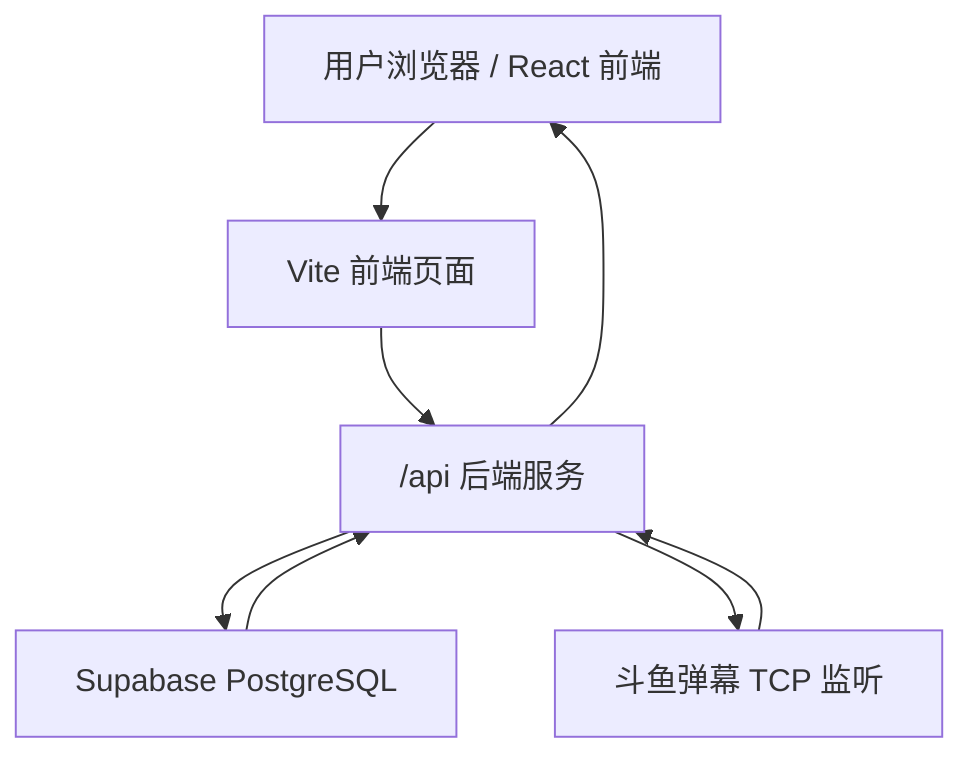

# 悬赏令技术接手文档

本文给接手开发/部署的人使用，重点说明现有 SQL 数据库如何接入“斗鱼账号绑定 + 用户登录”。

## 一句话结论

项目已经使用 Supabase PostgreSQL，不需要重建数据库。请合并功能分支后，在现有 Supabase 项目里执行增量 SQL：

```text
supabase/binding_increment.sql
```

不要为了绑定功能清空数据库，也不要重新创建一套数据库。

## 当前仓库和分支

- 仓库：[https://github.com/rialin-0523/bounty-board](https://github.com/rialin-0523/bounty-board)
- 功能 PR：[https://github.com/rialin-0523/bounty-board/pull/2](https://github.com/rialin-0523/bounty-board/pull/2)
- 功能分支：`codex/douyu-bind-flow`

## 项目架构



- 前端负责页面展示、生成绑定流程入口、轮询绑定状态、登录页。
- 后端负责生成识别码、监听斗鱼弹幕、写用户数据库、签发长期登录 Cookie。
- Supabase PostgreSQL 保存任务、绑定、用户和登录会话数据。

## 关键业务规则

1. 用户点击绑定斗鱼账号。
2. 后端生成 6 位识别码：大小写不敏感，数字 + 字母混合。
3. 识别码有效期 2 分钟，并且同一天不重复。
4. 用户必须用自己的斗鱼账号，把识别码原样发到指定直播间。
5. 后端只接受“弹幕内容完全等于识别码”，不接受夹杂其它文字。
6. 命中后必须保存斗鱼 UID；昵称只是展示字段，因为昵称可修改。
7. 同一个斗鱼 UID 只能绑定一个站内账号。
8. 用户设置用户名和密码后，正式账号写入 `app_users`。
9. 登录态通过 httpOnly Cookie 保持，数据库只保存 session token 哈希。

## 斗鱼监听策略

不是全程监听直播间。

- 平时不监听。
- 第一个用户生成绑定码时启动监听。
- 同时多人绑定时共用一个监听连接。
- 没有有效绑定码后，空闲 30 秒自动关闭监听。

相关代码：

- `server/index.mjs`：监听生命周期、API 路由、绑定状态刷新。
- `server/douyu.mjs`：斗鱼弹幕协议解析、头像地址规范化、资料字段提取。
- `server/store.mjs`：Supabase 写库、用户注册、登录会话。

## 与主分支新用户系统的兼容关系

主分支最新代码已经引入了另一套用户/权限库：`users`、`settings`、`created_by`、黑名单、最低斗鱼等级配置。

这个项目后续合并时要并行保留两套库，不要互相覆盖：

- `users` / `settings`：主分支已有的任务权限与黑名单体系。
- `app_users` / `auth_sessions` / `bind_sessions` / `douyu_profiles`：本次新增的斗鱼绑定与登录体系。

如果后续要做统一登录映射，可以再单独设计字段迁移，但当前阶段不要直接删掉主分支已有的 `users` / `settings`。

## 数据库说明

现有任务相关表继续保留：

- `challenges`
- `follow_orders`
- `challenge_gifts` 视图

斗鱼绑定新增 4 张表：

| 表 | 用途 |
|---|---|
| `douyu_profiles` | 斗鱼用户资料缓存，保存 UID、昵称、头像、等级、粉丝牌等 |
| `bind_sessions` | 识别码会话，保存 code、有效期、命中弹幕、状态 |
| `app_users` | 正式用户表，保存用户名、密码哈希、斗鱼 UID 等 |
| `auth_sessions` | 长期登录会话表，只保存 token 哈希 |

`app_users.douyu_uid` 是账号身份核心字段，必须唯一。

## 数据库执行方式

如果线上/合作 Supabase 已经有任务表，请只执行：

```text
supabase/binding_increment.sql
```

如果是全新空数据库，可以执行：

```text
supabase/migration.sql
```

推荐操作：

1. 打开 Supabase Dashboard。
2. 进入项目。
3. 打开 SQL Editor。
4. 粘贴 `supabase/binding_increment.sql` 全文。
5. Run。
6. 到 Table Editor 确认 4 张表已创建。

## 环境变量

复制 `.env.example` 为 `.env`，填真实值：

```bash
VITE_SUPABASE_URL=https://你的项目.supabase.co
VITE_SUPABASE_ANON_KEY=前端公开 publishable/anon key

SUPABASE_URL=https://你的项目.supabase.co
SUPABASE_SERVICE_ROLE_KEY=后端私密 service_role/secret key

DOUYU_BIND_ROOM_ID=63136
APP_TIME_ZONE=Asia/Shanghai
BIND_SERVER_ALLOW_ORIGIN=http://127.0.0.1:5173
DOUYU_BIND_IDLE_STOP_MS=30000
COOKIE_SECURE=false
```

线上 HTTPS 环境：

```bash
COOKIE_SECURE=true
```

注意：`SUPABASE_SERVICE_ROLE_KEY` / secret key 不能放前端，不能提交 GitHub，只能放服务端环境变量。

## 本地启动

```bash
npm install
npm run server
npm run dev
```

默认 Vite 会把 `/api` 代理到：

```text
http://127.0.0.1:8788
```

## 部署提醒

这个功能不能只部署静态前端，因为斗鱼弹幕监听需要常驻 Node 服务。

推荐：

- 前端：Vercel / 静态站点 / CDN。
- 后端：一台能常驻运行 Node 的服务器。
- 生产：前端域名和 `/api` 最好同域反向代理，方便 httpOnly Cookie 稳定生效。

## 验证清单

```bash
npm run build
npm run lint
node --check server/index.mjs
node --check server/douyu.mjs
node --check server/store.mjs
node --check server/auth.mjs
```

完整业务验证：

1. 打开 `/bind`。
2. 点击生成识别码。
3. 用斗鱼账号到 `DOUYU_BIND_ROOM_ID` 对应直播间发送该识别码。
4. 页面出现斗鱼 UID、昵称、头像、等级、粉丝牌。
5. 输入用户名和两次密码。
6. 完成绑定并跳回首页。
7. Supabase 检查：
   - `bind_sessions` 有 matched/completed 记录。
   - `app_users` 有用户记录，且 `douyu_uid` 不为空。
   - `auth_sessions` 有登录会话记录。
8. 关闭浏览器再打开，确认仍是登录状态。

## 常见问题

### 页面能打开，但生成识别码失败

检查后端是否启动，以及 `.env` 是否有 `SUPABASE_SERVICE_ROLE_KEY`。

### 能生成识别码，但发弹幕没反应

检查：

- `DOUYU_BIND_ROOM_ID` 是否是正确直播间。
- 后端日志是否显示斗鱼连接成功。
- 弹幕内容是否完全等于识别码。
- 是否已经超过 2 分钟。

### 绑定完成失败，提示斗鱼账号已绑定

这是正常保护：同一个斗鱼 UID 只能绑定一次。

### 昵称改了怎么办

不影响登录。系统身份认 `douyu_uid`，昵称只用于显示。
